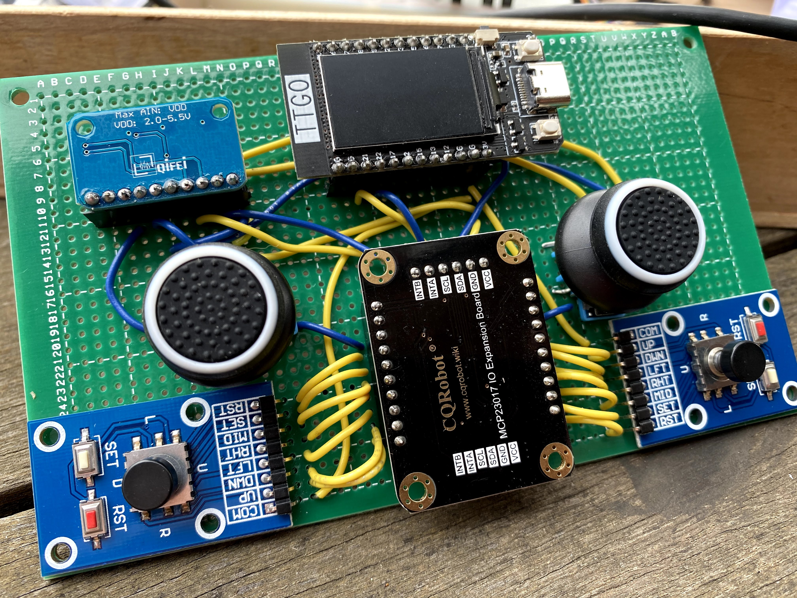
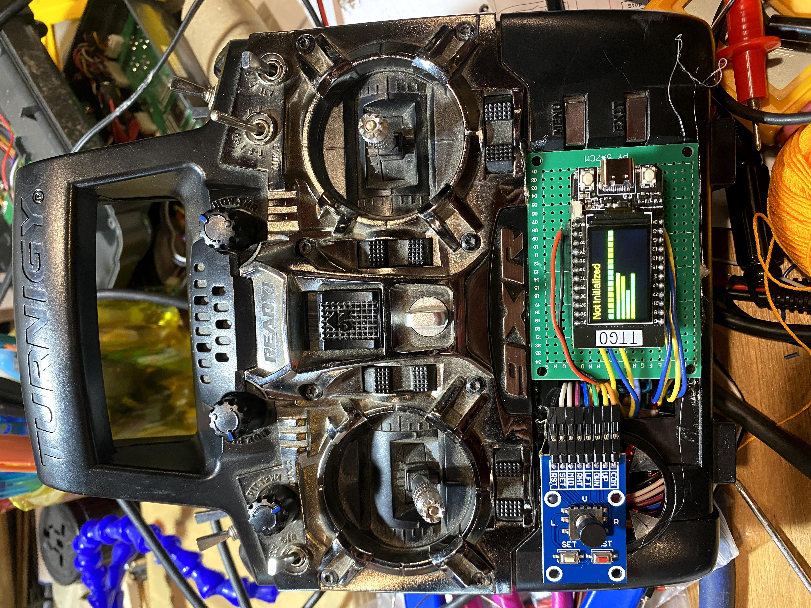
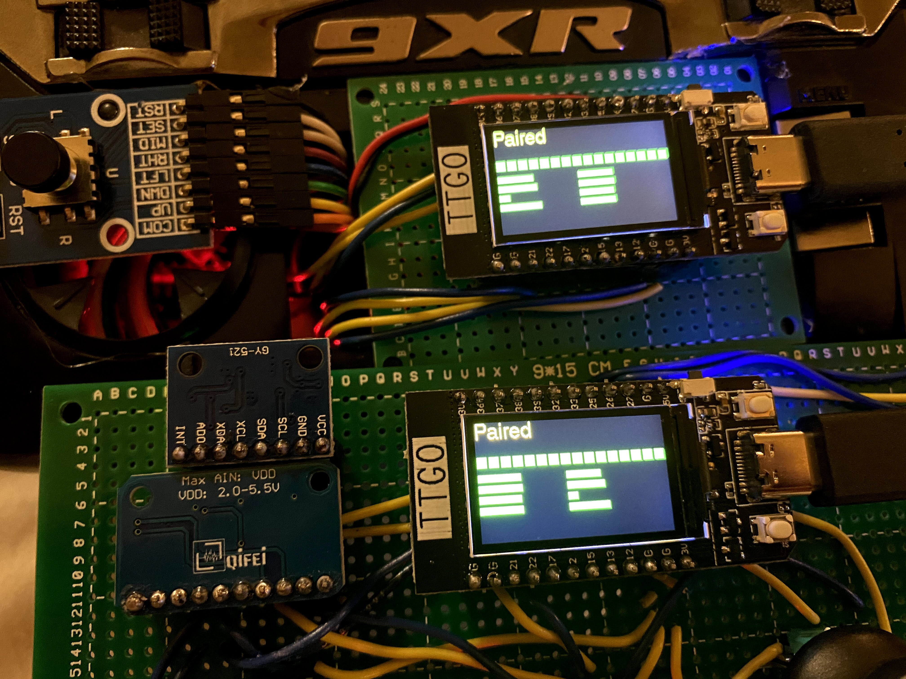

# RC Remote Control using ESP32

This project builds a buddy-box style RC transmitter that replaces the wired trainer port with ESP-NOW communication between two ESP32-based remotes. The primary sketch, `RemoteTxn.ino`, samples the gimbals and buttons through external ADC and GPIO expanders, renders status on a TFT display, and outputs a PPM stream for a radio frequency module. Configuration data is stored in EEPROM so the remote boots ready to fly.

## Hardware Overview
- TTGO T-Display ESP32 development board (integrated TFT)
- AD1015 4-channel 12-bit ADC breakout for reading gimbals
- MCP23017 16-channel I/O expander for buttons and trims
- Momentary buttons for boot menu navigation
- Analog gimbals from donor transmitter
- Optional IMU (MPU6050) reserved for future stabilization features
- Perfboard carrier that drops in to a Turnigy 9XR shell

Once paired, two remotes mirror trim and stick positions over ESP-NOW so instructor and student can share control.

## Repository Layout
- `RemoteTxn.ino` – Main sketch that drives the production hardware.
- `proof-of-concept/` – Early experiments split into ESP-NOW server, client, and raw PPM encoder sketches.
- `remote*.jpg` – Photos documenting the hardware build.

## Firmware Features
- Menu-driven startup workflow for loading stored calibration, calibrating gimbals/buttons, or trimming.
- EEPROM-backed profiles for stick scaling, button mapping, and trim offsets.
- Configurable mixer with standard and elevon mixing (`mixer()` in `RemoteTxn.ino`).
- PPM generation via ESP32 hardware timers (`onTimer()` ISR and `writePPM()`).
- Real-time TFT dashboard showing input, output, trim, and network status (`drawScreen()` and helpers).
- ESP-NOW messaging layer for buddy-box linking using [`SimpleEspNowConnection`](https://github.com/simplehow/SimpleEspNowConnection).

## Build & Flash
1. Install the [ESP32 Arduino core](https://github.com/espressif/arduino-esp32) in the Arduino IDE or PlatformIO.
2. Install the required libraries:
   - `SimpleEspNowConnection`
   - `Adafruit MCP23017`
   - `Adafruit ADS1X15`
   - `TFT_eSPI`
3. Clone this repository and open `RemoteTxn.ino`.
4. Select the **TTGO T-Display** (ESP32) board profile, set the correct COM/USB port, and upload.

> **Note:** `TFT_eSPI` expects a `User_Setup.h` tuned for the TTGO T-Display pinout. The stock "Setup25_TTGO_T_Display.h" is a good starting point.

## First Boot Workflow
1. The splash menu offers `Load Cfg` or `Calibrate`.
   - `Load Cfg` uses the most recent EEPROM settings.
   - `Calibrate` runs `calibrate()` and `calibrateButtons()` to map sticks and button channels, then persists via `writeCfg()`.
2. A second prompt allows `Calibrate Trim` (`calibrateTrim()`); otherwise, trims load from EEPROM.
3. Choose between **Server** or **Client** ESP-NOW role. The server waits for pairing requests; the client stores the peer MAC and reconnects automatically.

## Operating Logic
- `loop()` continuously services the ESP-NOW layer, refreshes inputs (`readAndScaleInputs()`), mixes outputs, and updates the PPM frame.
- Stick positions are scaled to 0–100%, trimmed, mixed, and written into the `channels[]` array sent to the ISR.
- When paired, `remoteData` from the peer overrides local sticks so both remotes stay synchronized.
- Channel 5 drives an LED indicator: lit on whichever unit currently holds instructor authority.

## Extending the Project
- The MPU6050 code stubs allow future stabilization or gesture control; enable by uncommenting the sensor includes and initialization.
- Additional mixes or flight modes can be added in `mixer()` and surfaced through the TFT menu system.
- Telemetry or haptic feedback can be layered on top of the existing ESP-NOW messaging struct (`struct_message`).

## Troubleshooting
- Serial output at 115200 baud logs calibration results and ESP-NOW pairing events (`OnPaired`, `OnConnected`).
- If pairing fails, hold BUTTON_1 at boot to re-run pairing (`startPairing(30)`).
- Ensure the ADS1015 and MCP23017 share the correct I²C address spacing; adjust `mcp.begin()` and `ads.begin()` if your modules differ.

## License
This project is open for experimentation and learning. Adapt it to your own trainer rig and contribute improvements back!
